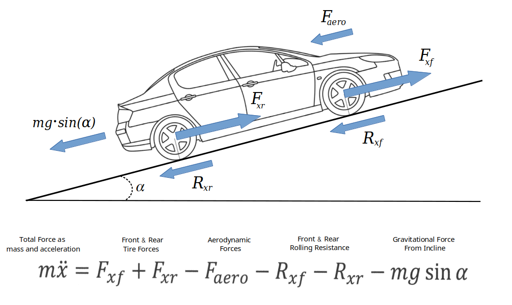

### Automotive Longitudinal Vehicle Dynamics Tutorial
##### - Mike Knerr 

#

Illustration - Mike Knerr

# 

This [tutorial notebook](longitudinal_vehicle_dynamics_tutorial) is a model for automotive longitudinal physics and dynamics. 

Includes test scenarios for various 2-dimensional terrain and throttle profiles. The reduction to 2D makes
it easier to concentrate on the longitudinal dynamics without being side-tracked by the kinematics of lateral motion.

The object oriented vehicle model expresses dynamics as an equation of forward, reverse
and opposing forces that would be typical for a vehicle in motion. Characteristic
parameters of the automobile model are set. A basic terrain geometry and motion profile is
defined. Euler time-step integration yields acceleration, velocity and longitudinal 
position over time. Graphics show different aspects of the motion plan when run is completed.

The parameters, 2D terrain geometry can be changed and experimented with to learn about 
the dynamic behavior of the model.

